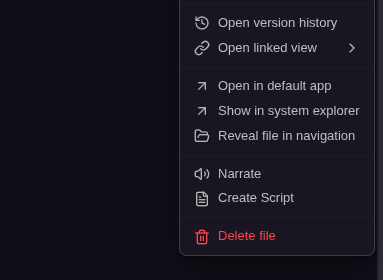
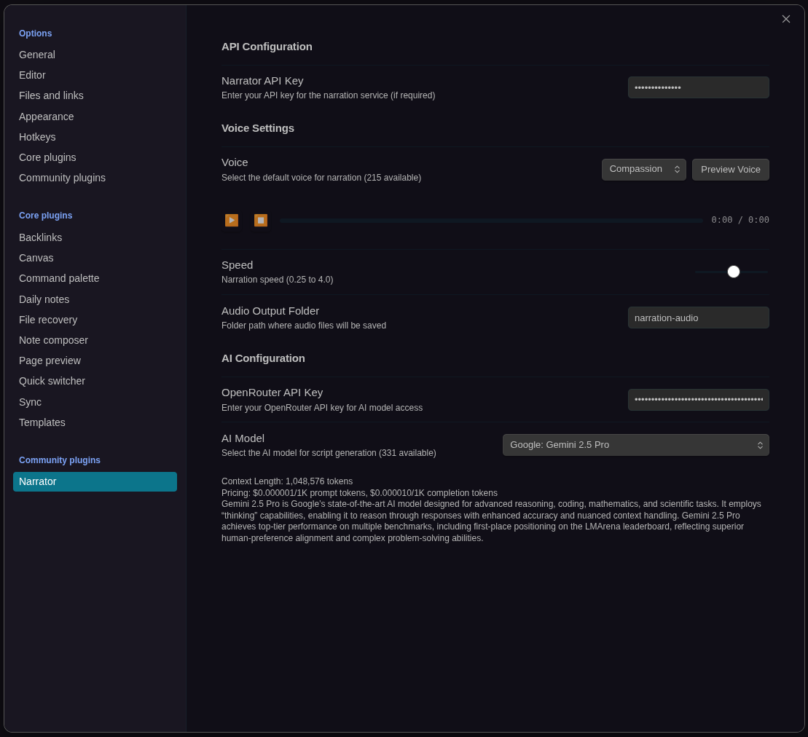
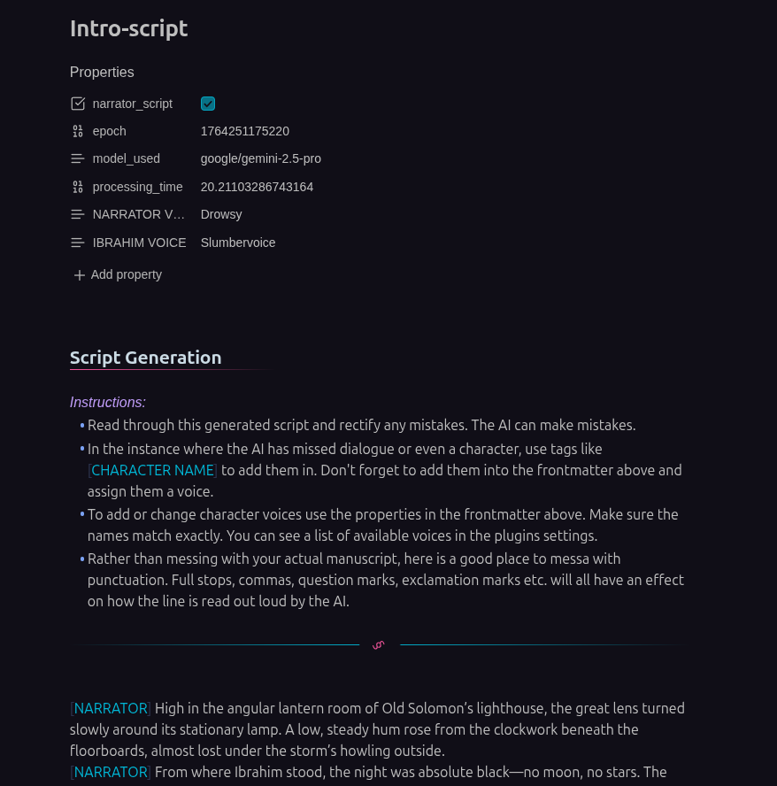

# Narrator

**Transform your markdown notes into professional narration with AI-powered
voices**

Narrator brings your Obsidian vault to life with real-time streaming audio
narration. Whether you're reviewing notes on the go, creating audiobooks from
your writing, or bringing multi-character stories to life, Narrator makes it
effortless.



## ✨ Features

### 🎙️ Real-Time Narration

- **One-click narration**: Right-click any note or selection to start streaming
  audio instantly
- **Live playback controls**: Play, pause, and stop from your status bar while
  narration streams
- **Automatic saving**: Every narration is saved as a high-quality WAV file in
  your chosen folder
- **Multiple voices**: Choose from various AI voices with instant preview in
  settings

### 🎭 AI-Powered Script Generation

- **Automatic character detection**: AI analyzes your writing and identifies
  dialogue and characters
- **Multi-voice narration**: Each character gets their own voice for
  audiobook-quality production
- **Smart formatting**: Scripts are generated with proper character tags and
  frontmatter
- **Voice customization**: Assign different voices to each character in your
  story

### ⚡ Seamless Integration

- **Context menu magic**: Right-click anywhere—files, selections, or scripts
- **Command palette support**: Quick access to all features via Cmd/Ctrl + P
- **No extra panels**: Everything works within your existing Obsidian workflow
- **Status bar controls**: Audio playback controls appear when you need them

### 🎨 Flexible Configuration

- **Voice preview**: Test voices before committing
- **Model selection**: Choose from multiple AI models with pricing and context
  info
- **Model control**: Adjust the output of the models in terms of speed and
  temperature
- **Custom output**: Configure where audio files are saved



## ⚠️ Prerequisites

**API Keys Needed**

1. **Narrator API Key**: For text-to-speech services (configure in plugin
   settings)
2. **OpenRouter API Key** (optional): For AI script generation with model
   selection

### From Obsidian Community Plugins

_Coming soon! This plugin is currently in development._

## 🚀 Quick Start

### Your First Narration

1. Right-click any markdown note in your file explorer
2. Select **"Narrate"** from the context menu
3. Watch as the status bar shows streaming audio controls
4. Audio starts playing immediately and saves automatically

That's it! Your narration will be saved to your configured audio output folder
(default: `narration-audio/`).

## 📖 Usage Guide

### Narrate Full Notes

Perfect for reviewing long documents or creating audiobook chapters.

1. Right-click any `.md` file in the file explorer
2. Select **"Narrate"**
3. Audio streams in real-time with status bar controls
4. Saved as: `{filename}-{voice}-{timestamp}.wav`

### Narrate Selected Text

Great for checking specific passages or getting quick feedback on your writing.

1. Highlight text in the editor
2. Right-click the selection
3. Select **"Narrate Selection"**
4. Audio streams immediately
5. Saved as: `{filename}-selection-{voice}-{timestamp}.wav`

### Create AI Scripts

Transform prose into dialogue-ready scripts with automatic character detection.

1. Right-click a markdown file
2. Select **"Create Script"**
3. AI analyzes your content and generates a script file
4. New file created: `{filename}-script.md`

The generated script includes:

- Detected characters
- Character tags for dialogue attribution
- Frontmatter for voice assignments
- Instructions for customization

### Narrate Multi-Character Scripts

Bring scripts to life with different voices for each character.

1. Open your script file (ends with `-script.md`)
2. **Assign voices** in the frontmatter:
   ```yaml
   ---
   narrator_script: true
   NARRATOR VOICE: "alloy/echo"
   JOHN VOICE: "onyx/nova"
   SARAH VOICE: "shimmer/fable"
   ---
   ```
3. Right-click the script file
4. Select **"Narrate Script"**
5. Each character speaks with their assigned voice!

## 📝 Script Format

Scripts use a simple, readable format:

```markdown
---
narrator_script: true
NARRATOR VOICE: "alloy/echo"
ALICE VOICE: "nova/shimmer"
BOB VOICE: "onyx/fable"
---

[NARRATOR] It was a dark and stormy night.

[ALICE] Did you hear that noise?

[BOB] Relax, it's just the wind.

[NARRATOR] But Alice knew better.
```

**Key elements:**

- **Frontmatter**: YAML with `narrator_script: true` and voice assignments
- **Character tags**: `[CHARACTER NAME]` before their dialogue
- **Voice format**: `"voice/model"` (see available voices in settings)
- **Fallback**: Unmapped characters use your default voice



## ⌨️ Command Palette

Access Narrator features via **Cmd/Ctrl + P**:

- **Narrate active note** - Narrate the currently open file
- **Create script from active note** - Generate AI script from current file
- **Narrate script** - Multi-voice narration (only visible when viewing a
  script)

## ⚙️ Configuration

Access settings via **Settings → Narrator**

### API Configuration

**Narrator API Key**

- Required for all text-to-speech operations
- Get your key from your backend service provider

**OpenRouter API Key** (optional)

- Required for AI script generation
- Enables model selection with pricing information
- [Get your key](https://openrouter.ai/)

### Voice Settings

**Voice Selection**

- Choose from available voices
- Click **"Preview Voice"** to hear a sample
- Voice assignments are per-user, not per-note

**Audio Output Folder**

- Customize where WAV files are saved
- Default: `narration-audio/`
- Folder is created automatically if it doesn't exist

### AI Configuration

**Model Selection**

- Choose from multiple AI models for script generation
- See pricing and context length for each model
- Default: `gpt-4o-mini` (cost-effective)

Popular models:

- **gpt-4o-mini**: Fast and affordable
- **gemini-2.5-pro**: Advanced character detection
- **claude-sonnet**: Excellent for dialogue formatting

## 🔧 Troubleshooting

### "API key not configured"

- Go to Settings → Narrator
- Enter your Narrator API key
- Save settings and try again

### "WebSocket connection failed" or 403 Forbidden

- Check API key is correct

### "Script contains no dialogue lines"

- Ensure script uses proper character tags: `[CHARACTER]`
- Check that frontmatter includes `narrator_script: true`
- Verify characters have non-empty dialogue

### Audio not playing

- Check your system audio is not muted
- Try a different voice in settings
- Check browser console for Web Audio API errors

### Script generation fails

- Ensure OpenRouter API key is configured
- Check you have credits/balance in your OpenRouter account
- Try a different AI model

## 🛠️ Development

### Build Commands

```bash
# Development mode (watches for changes)
pnpm run dev

# Production build
pnpm run build

# Deploy to your vault
pnpm run deploy

# Lint code
pnpm run lint
```

## 📄 License

MIT License - see [LICENSE](LICENSE) for details.

## 🙏 Support

Found a bug or have a feature request?

- [Open an issue](https://github.com/JTCorrin/narrator/issues) on GitHub
- Check existing issues first to avoid duplicates

## 👤 Credits

Created by **JTCorrin**

Built with:

- [Obsidian Plugin API](https://github.com/obsidianmd/obsidian-api)
- WebSocket Streaming
- Web Audio API
- OpenRouter for AI models

---

**Note**: This plugin is currently in active development. Features and API may
change. Please report any issues you encounter!
