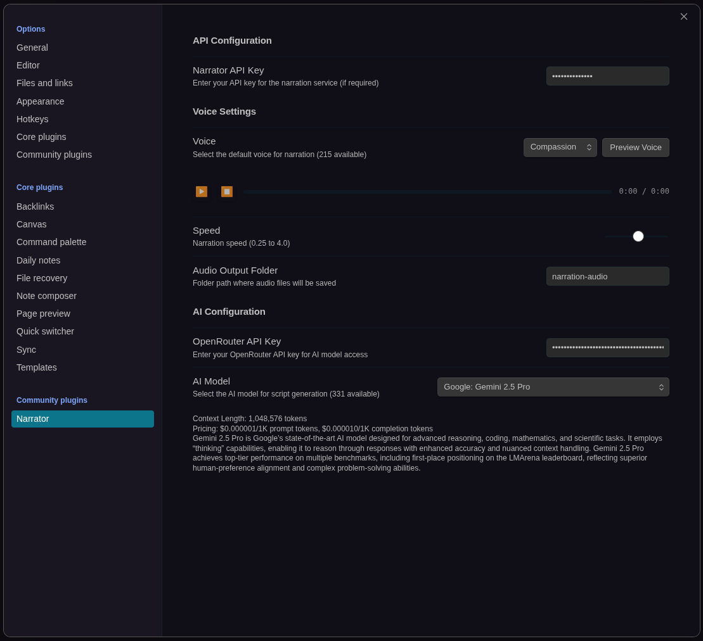
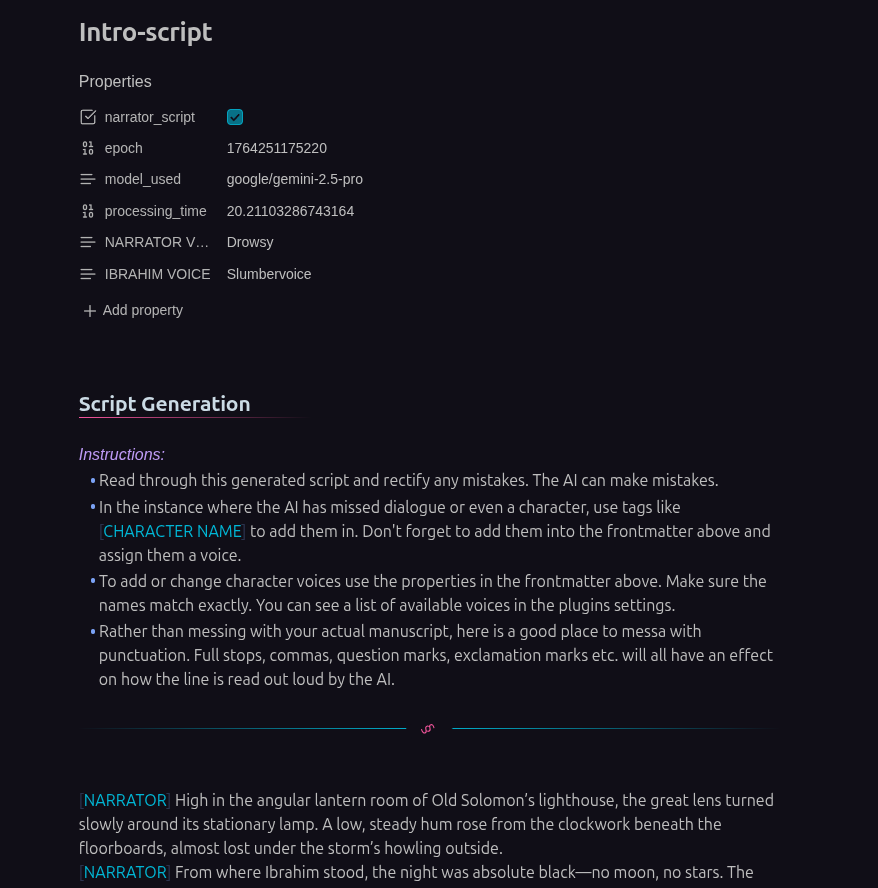

# Narrator

**Transform your markdown notes into professional narration with AI-powered
voices**

Narrator brings your Obsidian vault to life with real-time streaming audio
narration. Whether you're reviewing notes on the go, creating audiobooks from
your writing, or bringing multi-character stories to life, Narrator makes it
effortless.

## 🎬 Demo

[](https://www.youtube.com/watch?v=8ASCZV1xGXs)

_Click the image above to watch the demo video_

## ✨ Features

### 🎙️ Real-Time Narration

- **One-click narration**: Right-click any note or selection to start streaming
  audio instantly
- **Live playback controls**: Play, pause, and stop from your status bar while
  narration streams
- **Automatic saving**: Every narration is saved as a high-quality WAV file in
  your chosen folder
- **Multiple voices**: Choose from various AI voices with instant preview in
  settings

### 🎤 Live Speech-to-Text (ASR)

Dictate into your Markdown notes on Obsidian desktop. Narrator transcribes your
microphone audio into text at the cursor as words arrive, using the same Narrator
API key as narration.

### 🎭 AI-Powered Script Generation

- **Automatic character detection**: AI analyzes your writing and identifies
  dialogue and characters
- **Multi-voice narration**: Each character gets their own voice for
  audiobook-quality production
- **Smart formatting**: Scripts are generated with proper character tags and
  frontmatter
- **Voice customization**: Assign different voices to each character in your
  story

### ⚡ Seamless Integration

- **Context menu magic**: Right-click anywhere—files, selections, or scripts
- **Command palette support**: Quick access to all features via Cmd/Ctrl + P
- **No extra panels**: Everything works within your existing Obsidian workflow
- **Status bar controls**: Audio playback controls appear when you need them

### 🎨 Flexible Configuration

- **Voice preview**: Test voices before committing
- **Model selection**: Choose from multiple AI models with pricing and context
  info
- **Model control**: Adjust the output of the models in terms of speed and
  temperature
- **Custom output**: Configure where audio files are saved



## ⚠️ Prerequisites

**API Keys Needed**

1. **Narrator API Key**: For text-to-speech services (configure in plugin
   settings)
2. **OpenRouter API Key** (optional): For AI script generation with model
   selection

### Get your Narrator key

Choose Scribe ($9/month, 30,000 narrated words) or Author ($24/month,
100,000 narrated words) at [narrator.corrin.ai](https://narrator.corrin.ai/#pricing).
Both paid plans include the full voice collection. After Stripe checkout, copy
and save the API key shown in the same browser, then paste it into Narrator's
settings and click **Refresh voices**. The key is not sent by email.

Open **Subscription and usage → Manage billing** in plugin settings to check
usage, update payment details, view invoices, or cancel. Enter your Narrator API
key on that page. Cancellation keeps access until the end of the paid period.
Monthly words do not roll over; OpenRouter charges are separate.

The [Free plan](https://narrator.corrin.ai/free) provides an API key with 2,500
narrated words per UTC calendar month and 10 voices, with no payment details
required. Save the key shown in your browser; it is not sent by email.
The public speech demos are available without a subscription.

### Install from Community Plugins

1. Open **Settings → Community plugins**
2. Turn off **Restricted mode** if it is enabled
3. Open **Browse**, search for **Narrator**, then **Install** and **Enable**
4. Open **Settings → Narrator** and paste your Narrator API key (use the link button next to the field to open the key page)

### Manual install

1. Download `main.js`, `manifest.json`, and `styles.css` from the [latest GitHub release](https://github.com/JTCorrin/narrator/releases/latest)
2. Create a folder named `narrator` inside your vault's `.obsidian/plugins/` directory
3. Copy the three files into that folder
4. Enable **Narrator** under **Settings → Community plugins**

## 🚀 Quick Start

### Your First Narration

1. Right-click any markdown note in your file explorer
2. Select **"Narrate"** from the context menu
3. Watch as the status bar shows streaming audio controls
4. Audio plays as it arrives and saves automatically

That's it! Your narration will be saved to your configured audio output folder
(default: `narration-audio/`).

## 📖 Usage Guide

### Dictate into a note

1. On Obsidian desktop, open a Markdown note and place the cursor where you want
   the transcript inserted.
2. Click the microphone ribbon icon or run **Narrator: Record transcription**
   from the command palette.
3. Allow microphone access when prompted, then speak. Audio is sent to Narrator's
   speech service for transcription.
4. Click the recording status bar's stop control, or run the command again, to
   stop. Wait for **Transcription complete** so the final words can arrive.

Microphone transcription currently requires the desktop app. It uses your
Narrator API key; an OpenRouter key is not required. Developers can use the same
[ASR WebSocket API](https://narrator.corrin.ai/docs#stt-stream).

### Speech startup time

While Narrator settings are open, **Speech startup** checks readiness automatically.
It shows when the service is warming up or ready, with **Retry** and **Pause checks**
controls. **Preview voice** waits for readiness before generating audio and displays
its progress in settings. The stop control cancels a queued preview, and closing
settings stops readiness polling. Generated previews use your narration allowance.

After inactivity, the speech service may need a minute or more to warm up before
narration or transcription responds. Startup time varies; immediate playback is
not guaranteed. If a request times out, wait briefly and try again. During
transcription, text can also arrive after you stop recording while the final
audio is processed.

### Narrate Full Notes

Perfect for reviewing long documents or creating audiobook chapters.

1. Right-click any `.md` file in the file explorer
2. Select **"Narrate"**
3. Audio streams in real-time with status bar controls
4. Saved as: `{filename}-{voice}-{timestamp}.wav`

### Narrate Selected Text

Great for checking specific passages or getting quick feedback on your writing.

1. Highlight text in the editor
2. Right-click the selection
3. Select **"Narrate Selection"**
4. Audio streams immediately
5. Saved as: `{filename}-selection-{voice}-{timestamp}.wav`

### Create AI Scripts

Transform prose into dialogue-ready scripts with automatic character detection.

1. Right-click a markdown file
2. Select **"Create Script"**
3. AI analyzes your content and generates a script file
4. New file created: `{filename}-script.md`

The generated script includes:

- Detected characters
- Character tags for dialogue attribution
- Frontmatter for voice assignments
- Instructions for customization

### Narrate Multi-Character Scripts

Bring scripts to life with different voices for each character.

1. Open your script file (ends with `-script.md`)
2. **Assign voices** in the frontmatter:
   ```yaml
   ---
   narrator_script: true
   NARRATOR VOICE: "Compassion"
   JOHN VOICE: "Drowsy"
   SARAH VOICE: "Wonderstruck"
   ---
   ```
3. Right-click the script file
4. Select **"Narrate Script"**
5. Each character speaks with their assigned voice!

## 📝 Script Format

Scripts use a simple, readable format:

```markdown
---
narrator_script: true
NARRATOR VOICE: "Compassion"
ALICE VOICE: "Drowsy"
BOB VOICE: "Wonderstruck"
---

[NARRATOR] It was a dark and stormy night.

[ALICE] Did you hear that noise?

[BOB] Relax, it's just the wind.

[NARRATOR] But Alice knew better.
```

**Key elements:**

- **Frontmatter**: YAML with `narrator_script: true` and voice assignments
- **Character tags**: square-bracket labels such as `NARRATOR` or `ALICE` before each line of dialogue
- **Voice names**: use a voice listed in Settings → Narrator (for example Compassion, Drowsy, Wonderstruck, Chronicler)
- **Fallback**: unmapped characters use your default voice



## ⌨️ Command Palette

Access Narrator features via **Cmd/Ctrl + P**:

- **Record transcription** - Start or stop microphone dictation on desktop
- **Narrate active note** - Narrate the currently open file
- **Create script from active note** - Generate AI script from current file
- **Narrate script** - Multi-voice narration (only visible when viewing a
  script)

## ⚙️ Configuration

Access settings via **Settings → Narrator**

### API Configuration

**Narrator API Key**

- Required for all text-to-speech operations
- In Settings → Narrator, click the link button next to the key field to open the Narrator API site and create or copy a key

**OpenRouter API Key** (optional)

- Required for AI script generation
- Enables model selection with pricing information
- Create a key at [openrouter.ai](https://openrouter.ai/)

### Voice Settings

**Voice Selection**

- Choose from available voices
- Click **"Preview Voice"** to hear a sample
- Voice assignments are per-user, not per-note

**Audio Output Folder**

- Customize where WAV files are saved
- Default: `narration-audio/`
- Folder is created automatically if it doesn't exist

### AI Configuration

**Model Selection**

- Choose from multiple AI models for script generation
- See pricing and context length for each model
- Default: `gpt-4o-mini` (cost-effective)

Popular models:

- **gpt-4o-mini**: Fast and affordable
- **gemini-2.5-pro**: Advanced character detection
- **claude-sonnet**: Excellent for dialogue formatting

## 🔧 Troubleshooting

### "API key not configured"

- Go to Settings → Narrator
- Enter your Narrator API key
- Save settings and try again

### "WebSocket connection failed" or 403 Forbidden

- Check API key is correct

### "Script contains no dialogue lines"

- Ensure each dialogue line starts with a character label in square brackets (for example `NARRATOR` or `ALICE`)
- Check that frontmatter includes `narrator_script: true`
- Verify characters have non-empty dialogue

### Audio not playing

- Check your system audio is not muted
- Try a different voice in settings
- Check browser console for Web Audio API errors

### Script generation fails

- Ensure OpenRouter API key is configured
- Check you have credits/balance in your OpenRouter account
- Try a different AI model

## 🛠️ Development

### Build Commands

```bash
# Development mode (watches for changes)
pnpm run dev

# Production build
pnpm run build

# Deploy to your vault
pnpm run deploy

# Lint code
pnpm run lint
```

## 📄 License

MIT License - see [LICENSE](LICENSE) for details.

## 🙏 Support

Found a bug or have a feature request?

- [Open an issue](https://github.com/JTCorrin/narrator/issues) on GitHub
- Check existing issues first to avoid duplicates

## 👤 Credits

Created by **JTCorrin**

Built with:

- [Obsidian Plugin API](https://github.com/obsidianmd/obsidian-api)
- WebSocket Streaming
- Web Audio API
- OpenRouter for AI models

---

If something breaks or a voice sounds wrong, [open an issue](https://github.com/JTCorrin/narrator/issues) with the note type you were narrating and the steps that led to the problem.

### Submission checks and compatibility

Narrator requires Obsidian **1.4.0 or later**. On Obsidian 1.13+, its settings
participate in settings search; earlier supported versions render the same controls
through a fallback tab. Keep `manifest.json` and the current `versions.json` entry
aligned when changing the minimum version.

`pnpm lint` runs the official Obsidian recommended rules with TypeScript type
checking and treats warnings as failures. CI and release builds already invoke
this command. Run `pnpm test:ci` and `pnpm build` before submitting updated assets.
The linter currently uses ESLint 9 to match its dependency support; Obsidian 1.13
SDK types are needed for the searchable settings API despite the linter package's
older Obsidian peer declaration.

### Voices included with your account

Free accounts include ten selected voices. Paid accounts unlock the full voice
collection. The Voice setting loads the permitted catalogue from Narrator API;
use **Refresh voices** after changing your plan. If a saved voice is no longer
available, the plugin selects the first permitted voice. Script frontmatter must
also use voices included with your account; the API enforces this for every request.
